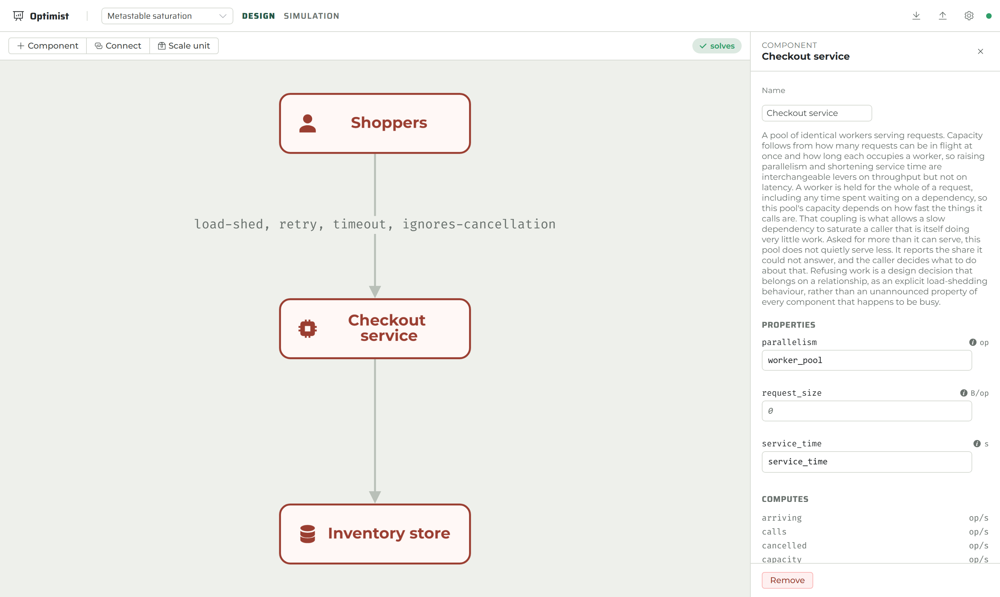
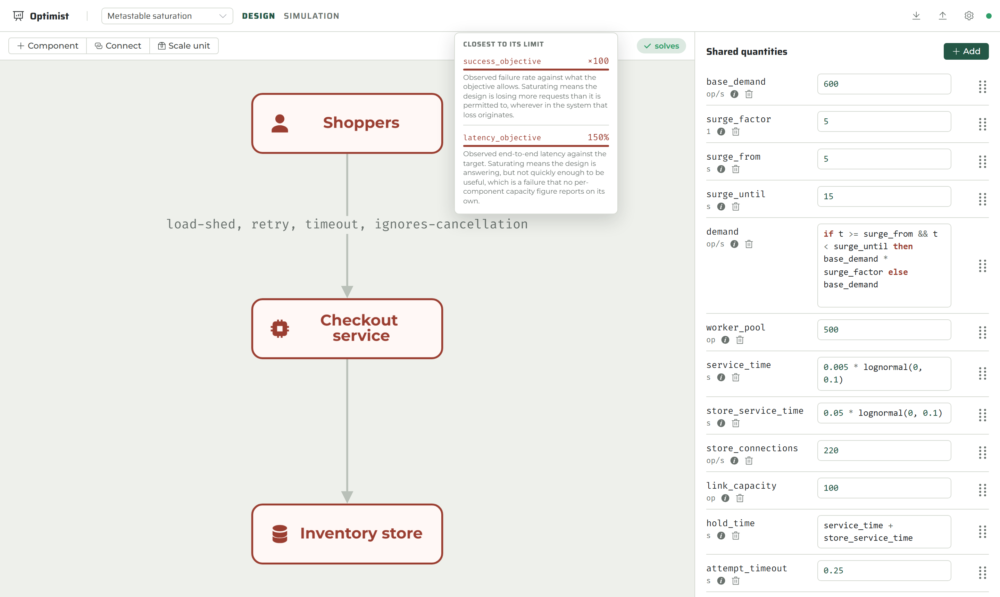
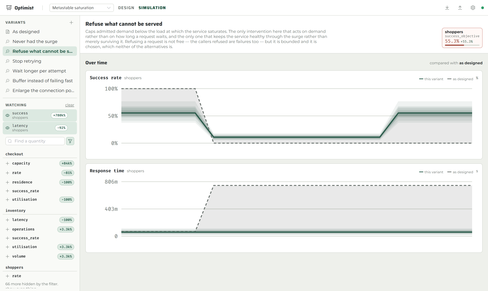

# Optimist

Optimist helps teams design large systems and find what constrains them.

A design is a graph of typed components — clients, load balancers, queues,
compute pools, datastores — wired together and annotated with the properties an
engineer can measure. Optimist solves that graph with uncertainty carried through
it and reports which resource limits the design is closest to exhausting.

A design is a directory of YAML that belongs in the same repository as the system
it describes, so answering a capacity question is a local operation and can run in
the same continuous integration that builds the thing being designed.

> [!IMPORTANT]
> Optimist is under active development. The modelling, solving, and ranking core
> is usable today, and the Vue workbench, HTTP API, and CLI all run against it.
> Authentication is not implemented.

## What it provides

- **Component-centric models:** components adopt a type, relationships wire them
  together, and behaviours on those relationships express retries, timeouts,
  caches, batching, fan-out, and shedding.
- **Component types as data:** properties, channels, ports, and constraints are
  declared in YAML manifests. Adding a kind of component means writing a
  manifest, not changing the engine, and a design may define its own.
- **Uncertainty carried through the solve:** every value is a Squiggle
  expression evaluated over aligned draws, so each draw settles on its own fixed
  point and the spread of a result is a genuine mixture.
- **Fixed-point solving:** relaxation toward a steady state, or transient
  integration through time when a design's memory is the question.
- **Bottleneck ranking:** constraints ordered by the share of draws in which
  demand meets or exceeds the limit, per scale unit.
- **Interventions and comparison:** a proposal rebinds named quantities and the
  design is solved again exactly as it stands, so a difference in the result is
  attributable.
- **Queueing and reliability laws built in:** Little's Law, M/M/1, M/M/c, Erlang
  B and C, bounded queues, retry amplification, deadline races, and error
  budgets.
- **Collaborative editing:** a server over a directory of designs, with a
  mutation feed over WebSocket and a Vue workbench.
- **Agent-friendly interfaces:** table, JSON, and JSONL CLI output plus a typed
  HTTP API.

## Quick look

Serve a directory of designs and open it in a browser. The diagram, what each
component is sized against, and whether the design solves are all on one screen.

```sh
cargo run --release -- serve --designs ./examples
```



Components are coloured by what they are closest to exhausting. Stopping on one
names that constraint, draws how loaded it is, and says what saturating it means.



A proposal rebinds named quantities and the design is solved again exactly as it
stands, with the baseline drawn on the same axes so the distance between the two
lines is the answer.



Constraints are ranked by `BINDS`, the share of draws in which demand met or
exceeded the limit:

$$P(\text{bind}) = \frac{1}{n}\sum_{i=1}^{n} \mathbb{1}\{d_i \geq l_i\}$$

Ranking by that rather than by mean utilisation puts the constraint most exposed
to a bad draw at the top, which is the one worth spending on.

## Run it

Optimist currently runs from source with Rust 1.96 or newer and Node 20 or newer:

```sh
npm --prefix workbench install
npm --prefix workbench run build
cargo run --release -- serve --designs ./examples
```

Release builds embed the frontend; debug builds look for `workbench/dist` beside
the repository. Point elsewhere with `--web-root` or `OPTIMIST_WEB_ROOT`. Rust
builds do not invoke Node; without a valid web root the server remains API-only.

## Ask it from a script

The same engine is a command-line tool, for continuous integration and
automation:

```sh
cargo run -- check       examples/checkout   # load and validate, without solving
cargo run -- catalogue   examples/checkout   # what component types are available
cargo run -- solve       examples/checkout   # the quantities flowing through it
cargo run -- bottlenecks examples/checkout   # what it is closest to exhausting
cargo run -- compare     examples/checkout warm-cache
```

```text
COMPONENT  CONSTRAINT          UTILISATION  P90      BINDS  REPLICAS  HEADROOM
orders     volume              7.009        9.555    100%   1         -3004303674979.1333
api        capacity            2.960        4.916    87%    1         -1063.2349
browsers   success_objective   55.626       109.865  86%    1         -0.2731
browsers   latency_objective   0.460        0.793    3%     1         0.4053
```

Use `--output json` or `--output jsonl` for automation, and `--seed`,
`--samples`, `--horizon`, `--step`, and `--transient` to control the solve.

## Serve a workspace

```sh
cargo run -- serve --designs ./designs
```

The server opens a directory of designs, applies typed mutations, streams every
change over a WebSocket, and solves designs on request. Clients patch their local
copy from the feed rather than refetching, so an edit made by somebody else does
not clobber a field you are typing into.

Edits are held in memory and written back to the design directory after a short
quiet period and again on shutdown, in canonical form, so a session produces a
clean `git diff`.

Browser routes fall back to `index.html`; generated files under `/assets` use a
one-year immutable cache while HTML revalidates on every load. `/api` and every
`/api/*` path remain JSON-only and never fall back to the application.

For front-end work, run Vite's dev server, which proxies `/api` including the
WebSocket upgrade:

```sh
npm --prefix workbench run dev     # http://127.0.0.1:5173
```

## What a design is made of

| Concept | Purpose |
| --- | --- |
| Component | One part of the system, adopting a component type. |
| Component type | Declares properties, channels, ports, and constraints. Data, not code. |
| Relationship | A wire between two components. Requests travel out, responses back, and work waits on it. |
| Signal | A named quantity travelling along a relationship: `rate`, `latency`, `success`, `capacity`, `occupancy`, `cancellation`, `payload`. |
| Behaviour | A rule about how work travels, attached to a relationship: retry, timeout, cache, batch, fan-out, load-shed. |
| Scratchpad | Quantities shared across the design, stated once. |
| Scale unit | A boundary within which components are replicated together; constraints are evaluated per unit. |
| Constraint | A demand paired with the limit it consumes. Every bottleneck is one of these. |
| Intervention | A proposed change, expressed as rebindings of shared quantities. |

```text
examples/checkout/
  _system.yaml                 name, shared quantities, scale units, interventions
  components/<id>.yaml         one component and the relationships leaving it
  component-types/<id>.yaml    types this design defines for itself (optional)
  mutators/<id>.yaml           behaviours this design defines for itself (optional)
```

## Documentation

The full VuePress documentation lives in [docs](docs/README.md).

```sh
cd docs
npm install
npm run dev
```

Build the static site with `npm run build`.

Useful starting points:

- [Getting started](docs/guide/README.md)
- [Designing a system](docs/guide/modelling.md)
- [Writing component types](docs/guide/component-types.md)
- [Uncertainty](docs/guide/uncertainty.md)
- [Solving and bottlenecks](docs/guide/analysis.md)
- [The workbench and shared editing](docs/guide/collaboration.md)
- [CLI reference](docs/reference/cli.md)
- [HTTP and WebSocket API](docs/reference/http-api.md)
- [Design directory format](docs/reference/yaml.md)
- [Shipped catalogue](docs/reference/catalogue.md)

## Worked examples

Five designs ship in [examples](examples/README.md), all covered by tests that
assert the conclusions they claim to teach:

- **`saturation`** — where saturation comes from, and why retrying past the fold
  lowers the share of requests that succeed rather than protecting it.
- **`queued-collapse`** — a queue makes the design second order: a ten second
  surge costs seventy seconds of recovery, and leaves it in a second steady
  state that persists once the backlog has gone.
- **`deadlines`** — a timeout bounds what the caller waits for; only a
  propagated one withdraws the work. Failing to propagate leaves the failure
  rate unchanged and doubles what the dependency is holding.
- **`checkout`** — a shop front where the binding constraint is the one nobody
  watches, and neither proposed fix addresses it.
- **`metastable`** — two steady states at one level of demand, built entirely
  from shipped component types.

## Verify the core

```sh
cargo test
cargo test --doc
RUSTDOCFLAGS="-D warnings" cargo doc --no-deps
cargo clippy --all-targets -- -D warnings
cargo fmt --check

npm --prefix workbench test
npm --prefix workbench run build

cd docs && npm install && npm run build
```

The nested fuzz workspace can be checked with:

```sh
cargo +nightly check --manifest-path fuzz/Cargo.toml --bins
cargo +nightly clippy --manifest-path fuzz/Cargo.toml --all-targets -- -D warnings
```

## Current limitations

- The on-disk schema is at version two. Version one described the causal graph
  this tool was built around before it became a system design tool; the two share
  no structure, so a version one directory is refused rather than converted.
- Editing is last-write-wins over whole entities. There are no revisions, no
  conflict resolution, and no merge.
- There is no authentication or authorisation. Anyone who can reach the port can
  read and edit every design in the workspace.
- The solver reports the fixed point reachable from rest. Where a design is
  bistable, the congested branch exists and is not searched for; a wide converged
  distribution is the signal that the design is near the fold.
- Unit annotations are validated for syntax but are not yet used to reject a
  property supplied in the wrong dimension.

The tracked implementation status is maintained in [TODO.md](TODO.md).

## Licence

No licence has been selected in this repository yet. Treat the code as
source-available for evaluation until a licence file is added.
